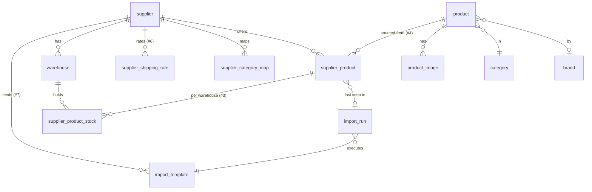

# Data model — multi-supplier product catalogue

This document describes the database design for managing products sourced from
many suppliers, each providing data in different shapes and via different feeds.

## Guiding principle: master product vs. supplier offer

The catalogue separates **what we sell** from **what each supplier provides**:

- **`product`** — the canonical item we sell. One row per real product,
  deduplicated across suppliers. Holds the "chosen"/normalised values we expose
  to storefronts.
- **`supplier_product`** — a supplier's *offer* for a product. One row per
  `(supplier × product)`. Holds that supplier's cost price, stock, reference
  code, weight (as supplied), and raw copies of name/description/image/category.

A product can therefore have **many** supplier offers (requirement #4), and an
offer can carry as little as cost + stock (requirement #2) while everything else
stays `NULL`.

## Tables

### supplier
The 10 suppliers and their defaults.

| column | type | notes |
|---|---|---|
| id | PK | |
| name | varchar(150) | |
| code | varchar(50) unique | short slug, e.g. `acme` |
| status | varchar(20) | active / inactive |
| default_currency | char(3) | e.g. `AUD` |
| default_weight_unit | varchar(4) | `g` / `kg` / `lb` / `oz` (#5) |
| website, contact_email | varchar | optional |
| created_at, updated_at | datetime | |

### import_template  *(already exists — extend with `supplier_id`)*
The per-supplier feed configuration (source = direct/url/ftp/sftp, format,
delimiter, key field, column mapping). Covers **#7**. Link it to a supplier so a
supplier can have one or more feeds.

### warehouse  *(#3)*
Stock locations. May belong to a supplier (their DC) or be our own.

| column | type | notes |
|---|---|---|
| id | PK | |
| supplier_id | FK→supplier, nullable | null = our own warehouse |
| code, name | varchar | |
| country, region, postcode | varchar | |

### category  +  supplier_category_map
A master taxonomy plus a mapping from each supplier's raw category text to ours.

- **category**: `id, parent_id (self-ref, hierarchical), name, slug, path`
- **supplier_category_map**: `id, supplier_id, supplier_category (raw string),
  category_id (→ master)` — so "Laptops & Notebooks" from one supplier and
  "Notebooks" from another both map to our `Laptops` category (#1).

### brand  *(optional)*
`id, name, slug` — referenced by `product.brand_id`.

### product  *(master / canonical)*
What we actually sell.

| column | type | notes |
|---|---|---|
| id | PK | |
| sku | varchar(100) unique | our internal master SKU |
| gtin | varchar(14) nullable, indexed | barcode/EAN/UPC — primary match key |
| title | varchar(255) | |
| short_description | text nullable | #8 |
| long_description | text nullable | #8 (stays null if no supplier provides it) |
| brand_id | FK nullable | |
| category_id | FK nullable | #1 |
| weight_grams | decimal(10,2) nullable | **normalised** weight (#5) |
| status | varchar(20) | active / draft / archived |
| primary_image_url | varchar nullable | |
| primary_supplier_product_id | FK nullable | the chosen source offer |
| sell_price | decimal(12,2) nullable | what we charge (derived from cost + rules) |
| created_at, updated_at | datetime | |

### product_image  *(#1)*
`id, product_id, url, alt, position` — many images per product.

### supplier_product  *(the offer — #2, #4, #5)*
The heart of the model. One row per supplier per product.

| column | type | notes |
|---|---|---|
| id | PK | |
| supplier_id | FK→supplier | |
| product_id | FK→product **nullable** | null until matched (staging) |
| supplier_ref_code | varchar(100) | supplier's own product ref |
| supplier_sku | varchar(100) nullable | |
| match_key | varchar(190) indexed | gtin or normalised ref used to dedupe |
| cost_price | decimal(12,4) | **required** (#2) |
| currency | char(3) | defaults to supplier currency |
| stock_quantity | int | **required** (#2) — total reported |
| weight_value | decimal(10,3) nullable | as supplied (#5) |
| weight_unit | varchar(4) nullable | `g`/`kg`/`lb`/`oz` (#5) |
| weight_grams | decimal(10,2) nullable | normalised on import |
| title, short_description, long_description | nullable | raw supplier copies (#8) |
| category_raw | varchar nullable | raw supplier category text |
| image_url | varchar nullable | raw supplier image |
| lead_time_days | int nullable | |
| is_primary | bool | chosen source for the linked product |
| last_import_run_id | FK nullable | provenance |
| last_seen_at | datetime | for detecting dropped products |
| created_at, updated_at | datetime | |

Constraints: `unique(supplier_id, supplier_ref_code)`.
Only `cost_price` + `stock_quantity` are required, so a "stock + price only"
feed (#2) creates a valid offer; product linkage can happen later by `match_key`.

### supplier_product_stock  *(#3)*
Per-warehouse stock for suppliers that break it down.

| column | type | notes |
|---|---|---|
| id | PK | |
| supplier_product_id | FK→supplier_product | |
| warehouse_id | FK→warehouse | |
| quantity | int | |
| updated_at | datetime | |

Constraint: `unique(supplier_product_id, warehouse_id)`. Suppliers that give a
single total simply keep it on `supplier_product.stock_quantity` (or one row).

### supplier_shipping_rate  *(#6)*
Flexible, tiered shipping rates per supplier.

| column | type | notes |
|---|---|---|
| id | PK | |
| supplier_id | FK→supplier | |
| name | varchar nullable | e.g. "Standard AU" |
| destination_country | char(2) nullable | null = any |
| rate_type | varchar(12) | `flat` / `by_weight` / `by_price` / `by_qty` |
| min_weight_grams, max_weight_grams | int nullable | weight tiers |
| min_order_value, max_order_value | decimal nullable | value tiers |
| price | decimal(12,2) | |
| currency | char(3) | |
| free_over | decimal nullable | free shipping threshold |

### import_run  *(recommended)*
A record of each executed import for auditing/provenance.

`id, import_template_id, supplier_id, status, rows_total, rows_created,
rows_updated, rows_failed, started_at, finished_at`.

## How each requirement is satisfied

| # | Requirement | Design |
|---|---|---|
| 1 | name, description, image, category, stock, cost, sku, ref | master fields on `product` + `product_image` + `category`; supplier-specific (`cost_price`, `stock_quantity`, `supplier_ref_code`, `supplier_sku`) on `supplier_product` |
| 2 | some give only stock + cost | `supplier_product` requires just `cost_price` + `stock_quantity`; all descriptive columns nullable |
| 3 | stock in different warehouses | `warehouse` + `supplier_product_stock` |
| 4 | product with >1 supplier | many `supplier_product` rows → one `product` |
| 5 | weight in g or kg | raw `weight_value` + `weight_unit`, normalised to `weight_grams` |
| 6 | shipping differs per supplier | `supplier_shipping_rate` (tiered) |
| 7 | feeds via ftp / link / direct | existing `import_template.source` linked to `supplier` |
| 8 | short vs short+long descriptions | `short_description` + `long_description` both nullable on `product` and `supplier_product` |

## Product matching (how an offer attaches to a product)

When importing a supplier feed, each row becomes/updates a `supplier_product`,
then we try to link it to a master `product`:

1. **By GTIN/barcode** (preferred) → `product.gtin = supplier_product.match_key`.
2. **By existing supplier ref** → previously linked offer for that supplier.
3. **Fallback** → leave `product_id` NULL and surface it in a "needs review"
   queue for manual linking or auto-create a new product.

The **primary supplier** for a product (the source whose data we publish, e.g.
cheapest in stock) is flagged via `supplier_product.is_primary` /
`product.primary_supplier_product_id`.

## Out of scope (future)
- Sell-price rules / margin engine (only `cost_price` and a simple `sell_price`
  are modelled here).
- Currency conversion between supplier currencies and the store currency.
- Variant-level sourcing (this models product-level offers; variants can be
  added as a `product_variant` table later).
